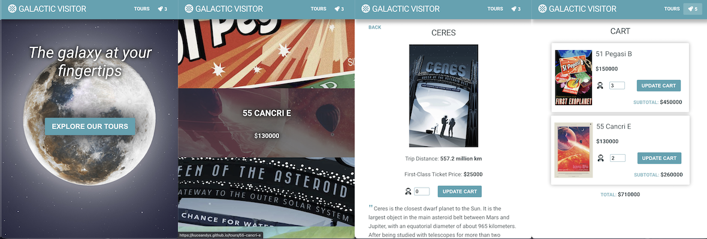

# _Galactic Visitor_ Shopping Cart Application

This is a web app designed for a fictional space travel company. We've all been dreaming of travel for the past year - why not dream a little further? (_Project Disclaimer: see below_)

:zap:[Live Demo](https://kuosandys.github.io/):zap:

## Purpose

This application is built with function-based React Components and uses `react-router-dom` to achieve dynamic routing in the front-end. The components are individually styled with `styled-components` to maximize reusability, and `react-responsive` for size-responsiveness. This project seeks to demonstrate knowledge of Hooks in React, as well as how functional components can use them to hold State. It also demonstrates an understanding of React concepts such as "conditional rendering", "lifting state up", and "controlled components".

## Features

Navigating to the site brings the user to the company's homepage with the slogan and the background image as the main focus. The Tours page shows all the tours currently offered, with the destination and the tour price appearing on hover. Clicking on each tour brings the user to a page containing more details about the chosen tour, as well as a way to add tickets for the tour to their cart. The Cart icon in the top-right corner updates its items dynamically, and shows the cart details and a link to the check-out page when clicked.

The user interface is built with the challenge of presenting visually diverse shop items in an uncluttered and organized way. This was achieved by keeping the shop interface simple, and by presenting information in a logical hierarchical way. Subtle animation is also added to engage the users on pages with less information displayed.

## Image and Text Source

All images are sourced from Nasa JPL's [_Visions of the Future Posters_](https://www.jpl.nasa.gov/galleries/visions-of-the-future) project, and the text is quoted from the description accompanying each poster. The posters are free to download from their website for personal use, and I do not claim ownership of the images or the text. The text from the descriptions were used in this project only for the purpose of placeholder text.

## Source

This project was built as part of The Odin Project's JavaScript curriculum. Project guidelines may be found [here](https://www.theodinproject.com/courses/javascript/lessons/shopping-cart).
